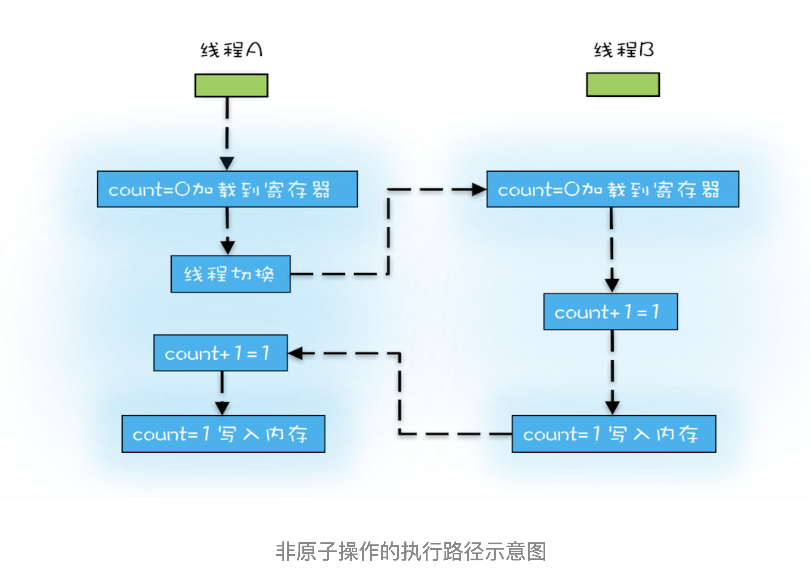

# 并发的本质

并发估计是很多人最头疼的问题, 因为人的大脑习惯性按照串行的方式去思维, 正所谓一心不能二用. 在早期的CPU开发时, 研发人员的研发方向都是都是在单核CPU上加速(让集成电路上拥有更多的电晶体)

但随着摩尔定律的失效, 人们发现单核CPU已经达到了瓶颈, 开始转向了多核CPU. 

## 源头
CPU, 内存, 硬盘的读写时间差距一直是我们头疼的部分, 有句话说的好, 天上一日(CPU), 人间一年(内存). 为了弥补这些差异,人们引进了很多优化手段
- 在CPU和内存之间添加缓存, 常见的L1, L2, L3缓存
- 操作系统增加进程, 线程, 以分时复用CPU, 进而均衡CPU和I/O设备差异
- 编程程序优化指令执行次序, 使得缓存能够更加合理利用


### 缓存导致的可见性
并发是什么? 并发就是调用多个线程做着同一件事或不同的事. 比如, 假期快结束了, 三个小伙伴一起写作业(同一件事). 为了补助好教室, 女生打扫卫生, 男士擦玻璃(不同件事).

对于共同做一件事, 问题就来了. 假设A和B同时对一个变量count, 进行加1的操作, 循环100次. A和B就是两个线程,调用着不同CPU操作这件事. 当A对count操作一次后, 为了方便, 把count放到了A's CPU的缓存中.**这就会导致A对count的修改, B是不可见的,B只会从内存中去读取count(这时候A还没把修改好的count刷回内存)

### 线程切换带来的原子性
首先,你要知道一件事. 在过去单线程的使用中, 我们是通过**时间切片**这个机制来产生多线程的感觉, 你以前肯定有过边听音乐, 边玩游戏的过程. 我们设置每50毫秒切换一次进程(从音乐到游戏), 因为时间片的时间很小很小,从人的使用来说是无感知的.

那既然要切换, 肯定会打断当前进程所做的工作. 我们会把当前进程工作的进展,环境都给记录下来. 然后再切换, 下次切换回来的时候, 再把这些记录重新载入. 如果进程过多, 光是切换的消耗就够我们受的了, 所以现在人们都开始用线程,而不是进程来处理工作.

第二, 我们现在所用的高级语言(Java, Python), 它的操作都不是原子性的, 比如简单的`count+1`, 它在汇编的层面,会被分成多条语句


如图, 所以当两个线程同时执行 count + 1 的操作时, 可能会出现诡异的形象, 比如 count只被加了一次.

记住, 原子性的操作往往都是CPU指令级别的, 而如今我们要想在高级语言中实现原子性, 都需要人为的干预

### 编译优化带来的有序性
编译器通常会对代码进行编译优化(gcc中还可以设置优化等级), 为什么要优化呢?

```
a = 10
xxx
xxx
a += 2
```
中途我们做了很多操作, 但都与a无关. 所以编译器可以优化成 a = 12. 除此之外, 更多的编译优化都是在汇编层面,甚至是硬件层面(CPU 指令集, 合理的运用寄存器, 运算器等), 可自行参考

优化会有什么后果呢?
```
a = 10
flag = true
```
上面这段代码, 对单线程来说, 谁先谁后都无所谓.
```
线程a:
a = 10
flag = true

线程b:
if(flag){
    print(a)
}
```
对于多线程来说,就会出问题. 假设先对flag赋值, 然后很不巧, 时间片切换. 线程b执行时, flag 为 true, 进入条件体,可这时候a还没被赋值, 产生bug

或者可参考 `单例模式的指令重排问题`

## Java Memory Model
> Java虚拟机规范中定义了Java内存模型(Java Memory Model, JMM), 用于屏蔽掉各种硬件和操作系统的内存访问差异,以实现Java程序在各种平台下都能达到效果一致的并发效果, JMM规范了Java虚拟机与计算机内存是如何协同工作的: 规定了一个线程如何和何时可以看到由其他线程修改过后的共享变量的值,以及在必须时如何同步访问共享变量

我想你看完这段介绍, 你大概也知道JMM推出的目的了, 是为了解决我们提到并发所带的三种问题.

JMM很庞大, 但我们不需要懂这么多, 我们只需要从程序猿的视界来看待就好了.

它包含三个修饰符: `synchronized`, `final`, `volatile`, 以及六项 `happend-before`的规则

## `volatile`
volatile 关键词解决了两件事
- valatitle前后禁止指令重排
- 对其修饰的变量再被修改后会立即写回到内存

它解决了前面我们说的 可见性 和 有序性. 但没有解决原子性.

比如, 还是上文的 count + 1的理解, 两个线程都被允许同时从内存读到count的原先值, 然后都对它进行了 + 1的修改, 同时写回到内存中. 所以结果还是 count + 1.

它适用的范围比较少(比如说, 适用于对变量的赋值,而不是累加(x = 10, 不是x += 1), 但用好了, 能提高程序的性能. 因为它本质上是无锁的产物, 任何东西一旦沾上锁, 性能就会减低(将并行串行化). 

`final`就是我们熟知的生而不变, 一旦赋值后, 就不能再改变. 

## `synchronized`
为什么`volatitle`并没有解决原子性的问题呢, 因为它没对该变量(准确来说,是该临界区)进行互斥, 使得任何人可以在任何时机访问到它

我们的对它的诉求就是 **同一时刻,只能由同一个线程执行** ->  互斥

我们将设置一个区域, **临界区**, 对这个区域上锁, 表示同一时刻只能由一个线程访问. 什么时候要设置这个区域呢? 当你的代码中存在某一段能被多个线程访问且修改时.

```
synchronized(对象){
    xxx
    xxx
}
```

java中的synchronized包含了自动上锁和释放锁的功能. 

## `happens-before`规则
`happens-before`是JMM为了强化, 也为了符合人类逻辑对编译器作出的约束
> x happens-before y, 我们说关于对x操作后的结果, 从y的角度来看,都是可以见的

1. 程序的顺序性规则. 
    
    指在一个线程中, 按照程序顺序, 前面操作的 `happens-before` 于后续的任意操作. 这里要强调一下, 所谓顺序，指的是你可以用顺序的方式推演程序的执行，但程序的执行不一定是完全顺序的, 编译器保证结果一定 == 顺序方式推演的结果
    ``` java
    例子1:
    x = 10;
    y = 20;
    x += 2;
    
    这里编译器可能会进行优化, 改成 x = 12, y = 10. 但并不影响程序是顺序的. 结果是等于顺序方式推演的
    
    例子2:
    x = 10;
    y = 20;
    x += y;
    
    这里第三条语句永远要在最后, 如果改变了, 就不符合顺序方式推演的结果了
    ```
2. volatile变量规则. 
    
    一个线程对volatitle进行写修改后, `happens-before` 于后续的volatitle的读操作
3. 传递性. 
    
    A `happens-before` B, B `happens-before` C. 那么 A `happens-before` C. 我们把规则1,2,3结合起来. 一个线程在volatile写操作前,对变量进行了修改. 那么另一个线程在读volatile变量时, 对于其他变量的修改值也是可见的
    ```java
    int x;
    volatitle int y;
    void writer(){
        x = 10;
        y = true;
    }
    
    void reader(){
        if(y){
            print(x)    // 为10
        }
    }
    ```
4. 锁规则
    
    一个锁的解锁  `happens-before`于后续对该的加锁.
    ```java
    synchronized (this) { // 此处自动加锁
    // x 是共享变量, 初始值 =10
    if (this.x < 12) {
        this.x = 12; 
    }  
    } // 此处自动解锁, 下个线程进行加锁时, x为12
    ```
5. 线程 start() 规则
    
    主线程 A 启动子线程 B 后，子线程 B 能够看到主线程在启动子线程 B 前的操作。
6. 线程 join() 规则. 
    
    指主线程 A 等待子线程 B 完成（主线程 A 通过调用子线程 B 的 join() 方法实现），当子线程 B 完成后（主线程 A 中 join() 方法返回），主线程能够看到子线程的操作。当然所谓的“看到”，指的是对共享变量的操作。
7. 线程中断规则. 
    
    对线程interrupt()方法的调用 `happens-before` 于被中断线程的代码检测到中断事件的发生，可以通过Thread.interrupted()方法检测到是否有中断发生。
8. 对象终结规则. 
    
    一个对象的初始化完成(构造函数执行结束) `happens-before`于 它的finalize()方法的开始

你可能说, 这些规则不是应该的吗, 在并发的世界了, 没有什么是应该的~~(假装高深一波)

