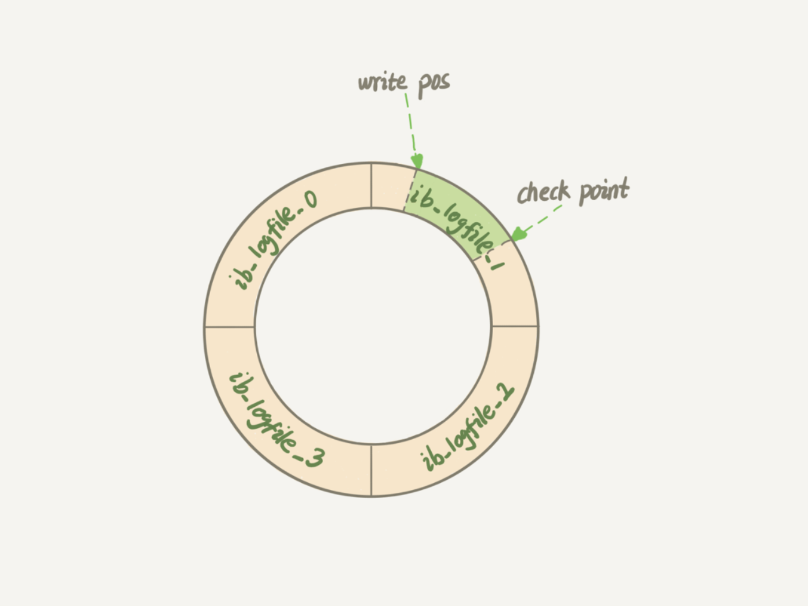

# 事务
事务是数据库和文件系统差异不同的体现. 参考 [transactions](http://www.mathcs.emory.edu/~cheung/Courses/377/Syllabus/10-Transactions)

事务的标准 -> ACID:
- Atomicity, 原子性
- Consistency, 一致性
- Isolation, 隔离性
- Duralibility, 持久性

通过ACID这四个标准, 使得事务成为了**并发控制的基础单元**.我们来细致的看下, 在Mysql中是如何实现这四个标准的

注意: 事务是InnoDB(引擎层)方面的技术.

## Atomicity, 原子性
何为原子性? 一个事务包含许多个操作, 那我们对于这些操作的要求是: **要么全部都完成, 要么全部都失败**

例如: 银行转账,Alice向Blob转1000元:
- 查询Alice账户余额
- 扣除Aclie 1000元
- 转入Blob 1000元

对于2,3步来说, 如果一步完成,一步没完成.那结果会是灾难性的

那么如何去保证原子性呢?
先来看个参数 `Auto Commit`.  Mysql默认开启这个参数, 表示: 对于那些不显示开启事务的Mysql语句, 默认每一条都当成一个事务.

下面为手动开启事务:
```mysql
begin;

select monny from users where name = 'Alice';
update monny = monny - 1000 from users where name = 'Alice';
update monny = monny + 1000 from users where name = 'Blob';

commit; or rollback;

commit 代表 事务提交
rollback 代表 事务回滚
```

## 一条update语句
我们先去思考事务中只存在一条写入(可以是delete, insert).  
`update T set x = x + 1 where id = 2` , 这条语句会执行两个部分, 
- Server让InnoDB引擎读取T表中id为2的数据页(引擎会对该页进行缓存), 然后在Server层对x加1.
- 将修改后的值发送回InnoDB引擎, 后者修改缓存中的对应值, 形成脏页. 待到一定的时间, InnoDB会将脏页刷回到磁盘

这里就存在着一个问题: 缓存中记录的是实际值, 所以当我们修改后, 如何能找回修改前的值?

## WAL(Write Ahead Logging)
> "In computer science, write-ahead logging (WAL) is a family of techniques for providing atomicity and durability (two of the ACID properties) in database systems."

在使用WAL的系统中, 所有的修改都**先被写到日志中**, 然后再应用到系统状态中. 如果我们不实用WAL机制, 当我们将修改直接操作在系统上时, 如果遇到数据库崩溃, 那么我们无法获知该事务成功与否

### `undo log`
> 保存了事务发生前的数据的版本, 可用于事务的回滚, 也可用于MVVC(多并发控制版本)下的读

`undo log`记录的是逻辑语句, 比如事务要insert一条数据,那么事务开始时, undo log会记录为(delete 这条语句)

```
start T id
update T set x =  x(这里是固定值) where id = 2
(设置完成后, 事务开始更新内存值)

commit T id
```

通过 `undo log`, 我们很好的实现了事务的原子性, 即通过日志的手段来人为的保证事务要么全部成功, 要么全部失败.

Ps: `undo log` 的内容也是需要记录在`redo log`(下面会提到)中的. 同时`undo log`的结构是数据库中的段, 而不是日志

## Duralibility, 持久性
还是上文的语句, 我们已经知道了语句在更新时, 是需要先记录到缓存中,形成脏读. 等到某个时刻, InnoDB进行写入. 那假设, 这两个时刻期间, 出现了down机, 就会造成数据丢失. 有人会说, 能不能每次写入到会直接更新到硬盘, 请记住对于并发量大的数据库, 产生的I/O开销是十分可怕的.

一样, WAL机制能够保证数据的持久性.

### `redo log`
redo log 是引擎层面的日志, 它记录的是 **相应磁盘页对应的数据的修改内容**, 因为是引擎层面, 所以我们不需要去记录逻辑语句(binlog会记录), 我们只保存实际的物理记录.

我们再来分析上面的语句, 第一部分的时候, InnoDB读取id为2的数据, 同时将该数据页缓存到内存中, 第二部分时:
- 修改缓存中相应的内容
- 记录到redo log buffer中, 格式为
    -  start, T(事务id)
    -  w, T, x, value
    -  commit, T
- 当收到commit语句时(前面提到, 对于任意一语句,都是隐式提交), 将`redo log buffer`中的数据刷入到磁盘的 redo log文件.

这里有两个重点, 要解释
1. redo log记录的是相对页的相对数据的更新值, 所以它无法替代InnoDB对磁盘的写入(也就是将缓存中的脏数据写回到磁盘中)
2. redo log最后还是要记录到磁盘中, 那它快在哪里? redo log是追加写入, 也就是我们说的顺序写入, 顺序写入相比磁盘的随机写入在老式机械硬盘上差距特别明显

针对1, 既然无法代替, 那它的作用在哪? **redo log**具备**crash-safe**能力, 当数据库异常崩溃时
- 读取磁盘中的redo log文件
- 将该文件中涉及到的修改数据的数据页从磁盘中读取到内存
- 对内存的数据进行修改, 形成脏读

后续与正常的脏读写入一致,不再描述

在读取`redo log file`时, 从哪个位置开始读取?  
  
InnoDB 的 redo log 是固定大小的，比如可以配置为一组 4 个文件，每个文件的大小是 1GB，那么这块“粉板”总共就可以记录 4GB 的操作。从头开始写，写到末尾就又回到开头循环写.会有两个指针, 一个是`write pos`, 代表接下里写入的位置, 一个是`checkpoint`, 代表崩溃时从这里开始读取数据.当`write pos`指针赶上`checkpoint`时,代表记录满了, 需要InnoDB强行对内存进行脏读写入.

## `binlog`
Mysql 是由两部分组成的, 一部分是Mysql层, 一部分是存储层. 对于早期的Mysql来说, 它使用的MyISAM, 而MyISAM并不包含crash-safe的能力, 所以前面提到的`redo log`是InnoDB特有的机制,或者说是特意开发的.

`redo log`记录的是实际的存储内容(针对特定的数据页),所以当数据库崩溃的时候,能很快的恢复. 但是对于别的场景, 比如数据归档, 你想将数据恢复到某一天的某个时刻, 再或者 主从复制(磁盘是随机读写, 两个数据表在主从的磁盘位置可能是不一样的).

所以, `binlog`是在Server层面的, 它是逻辑日志, 记录的是语句, 比如“给 ID=2 这一行的 c 字段加 1 ”。而且该文件不是循环读写, 它是追加写入, 写满一个文件, 就再创建一个新文件

### 两阶段提交
我们已经知道了,在任何写操作语句中, 都需要对`redo log`和 `binlog`进行修改. 然后这里又引申了一个问题

  
如果其中一个修改成功, 另外一个修改失败会怎么样? => 数据不一致, 所以我们需要两阶段提交机制(在分布式中很常见), 当确保两个文件都写入成功时,才能算正式提交.

当发生崩溃重启时, 数据库从磁盘中加载`redo log`后, 顺序扫描
- 如果某一事务含有commit, 直接提交
- 不存在commit, 通过判断 binlog 文件来决定是否写入完整(binlog 和 redo log 通过XID(事务ID)来匹配). 若不完整, 丢弃


