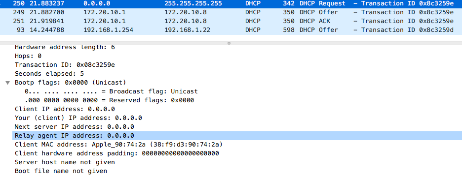
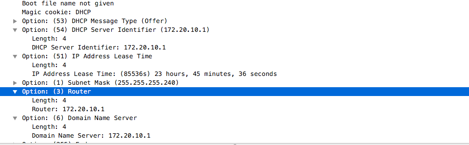

DNS和HDCP作为内网搭建的两大必备神器,我们今天就来讲讲它的功能

## DHCP
DHCP(动态主机设置协议) 通常被应用在大型的局域网环境中,主要作用是集中的管理、分配IP地址. 可以说正是因为这个协议,才导致IP如此的盛行.只要进入到该内网的设备,都可以自动的获取到一个IP地址, 而且对用户来说,是无感知,透明的.

这里我们主要了解两个方面, 1.它是如何运作的? 2.为什么是基于UDP协议

### DHCP的四次通讯


我们通过进行一次抓包来演示:  


第一步(Discover):  
在跟dhcp通讯时,我们此刻时没有IP地址的,所以用`(0.0.0.0)`来代替. 然后对于DHCP地址,我们也是不知道的,我们用`(255.255.255.255)`来代替,表示**广播查询**  
广播查询这个词很关键, 你想想,当你刚到一个办公室时,你没钥匙开门, 你肯定需要“广播”问一遍所有人, 查询谁负责开门的. 但“广播”这个词跟TCP是格格不入的,因为TCP是端对端的通讯.所以你需要“一个个”去询问,每次询问还要建立三次握手.这也太麻烦了

再来看下一个关键词, `Broadcast flag: Unicast(Broadcast`. 它表示当dhcp收到时,是以单播(一对一)的形式回复还是广播  

最后一个关键词是, `Client MAC address: xxxxx`. 这也是最重要的一个, 你想啊, 你在没有IP地址的情况下, DHCP是如何找到你的呢? 你可以说,DHCP可以再次通过广播找到我, 但如果此时有两个台机器都在申请IP地址呢?, 你如何确定是发给哪个人的.   
MAC地址就体现除出了作用(因为它是全球唯一标识, 全球只此一家,别无分店), 同时它也是第两层通讯的保证(链路层)

总结下第一步: 我们用了个默认地址, 对“所有人”发送一个广播,宣传我希望获得一个IP地址, 同时告知了我的MAC地址(让DHCP能够找到我)



第二步(Offer)
当DHCP收到后, 它就会给你一个回包, 这里面包含
- IP地址
- 网关地址
- DNS服务器地址
- 过期时间

第三步(Request):
如果你注意看图,你会发现第三步的时候,这台机器还没用上DHCP所给的IP地址,然后发送方式还是广播(是因为害羞么?)  
当然不是, 你想, 假如你公司内有两台DHCP,而且都同时给它发送了新IP地址, 它需要通过广播去告知两台服务器, 对于征用的服务器, 它告知我使用了你的IP地址,请确认. 对于非征用的, 它告知, 我已经使用其他人的IP地址了,请你收回你给我发的IP地址

第四步(ACK):  
服务器回复ACK,表示确认. 然后机器都会使用上它获得的IP地址进行之后的通讯.

### 网吧用的是DHCP协议吗?
网吧用的都不是DHCP,一般都是配置静态地址, 原因是因为 **监控困难**. 因为机器每次重启后收到的IP地址是不一样的, 查找起来会很麻烦,不方便定位.


## DNS
DNS(Domian Name System)的作用非常简单, 就是根据域名查出IP地址. 你还记得网络层和传输层的区别吗? 网络层是`端到端的连接`, 传输层是`端口到端口的连接`.那这个端指的是什么呢? 就是每台**带有IP地址的**设备  

再去思考下, 你每天都在浏览网页. 网页的背后应该是一台台服务器吧, 然后你是通过`url`去访问的这台服务器,例如 www.baidu.com 这个`url`我们称自为域名.
那为什么通过这个域名就能知道这台服务器了呢? 要想找到这台服务器不应该是是通过 IP 地址吗.

DNS就作用就是在这中间, 它是 **域名和IP地址之间的桥梁**, 使得我们不需要去记那些复杂的IP地址. 你可以尝试在浏览器中输入`103.235.46.39`,得到的结果还是百度这个页面

```
尝试在电脑上输入 `dig www.baidu.com`

 <<>> DiG 9.10.6 <<>> www.baidu.com
;; global options: +cmd
;; Got answer:
;; ->>HEADER<<- opcode: QUERY, status: NOERROR, id: 60753
;; flags: qr rd ra; QUERY: 1, ANSWER: 3, AUTHORITY: 2, ADDITIONAL: 3

;; OPT PSEUDOSECTION:
; EDNS: version: 0, flags:; udp: 4096
;; QUESTION SECTION:
;www.baidu.com.			IN	A

;; ANSWER SECTION:
www.baidu.com.		1008	IN	CNAME	www.a.shifen.com.
www.a.shifen.com.	798	IN	CNAME	www.wshifen.com.
www.wshifen.com.	838	IN	A	103.235.46.39     <- 就是这个IP

;; AUTHORITY SECTION:
wshifen.com.		1791	IN	NS	ns3.wshifen.com.
wshifen.com.		1791	IN	NS	ns4.wshifen.com.

;; ADDITIONAL SECTION:
ns3.wshifen.com.	908	IN	A	180.76.8.250
ns4.wshifen.com.	1084	IN	A	180.76.9.250

;; Query time: 27 msec
;; SERVER: 192.168.1.254#53(192.168.1.254)
;; WHEN: Fri Mar 06 20:38:59 CET 2020
;; MSG SIZE  rcvd: 179
```

我们试着来解析下上面的内容

第一段是参数,我们忽略

第二段是 QUESTION SECTION, 我们想要查询的东西 -> 我们想查找 www.baidu.com 的 IP地址 (在DNS中 A 代表 address的意思). 

第三段是 ANSWER SECTION, 也就是返回的答案. CNAME就是别名的意思, 相当于做了一层跳转  
=> 我们要访问 www.baidu.com 就等于访问 www.a.shifen.com.  
=> 访问 www.a.shifen.com.  就等于访问 www.wshifen.com.
=> 访问 www.wshifen.com. 给出了我们的答案 A记录 103.235.46.39

这里你可能会问, 为什么访问一个百度需要那么多的跳转(或者你电脑上的为什么跟我不一样). 直接 www.baidu.com IN A 103.235.46.39 不就行了吗.这里百度的做法实际上跟CDN有关.(这里不对CDN做过多的解释)

除此之外, CNAME的好处在便于管理. 一会再提到

第四段和第五段是 ANSWER SECTION, 代表是谁告诉你这些信息的. ADDITIONAL SECTION 代表告诉你的这些人,它们的IP地址又是多少

第六段是传输信息

### DNS的分级管理
为什么我们访问的是 www.baidu.com 出来的结果是 www.baidu.com. 呢(其实结果不是 www.baidu.com., 而是 www.baidu.com.root)  
我们对连接的每个点进行划分,可以得到`www`, `baidu`, `com`, `root`. 每一个都是一个等级,最高级为最右边(root), 最低级最左(www)

分级有什么用呢? 再回答它前, 你先想, 这些信息是谁来提供的呢? 同时又如何确保信息的准确呢?  
本质上我们可以把DNS理解为电话簿, 我们想打某一个人的电话时,通过名字(域名) -> 查找电话薄(DNS) -> 获取电话(IP). 那我们只要将这个电话薄放到一个人那里管理就好了, 全球的人都来找它. 可全球的人太多了, 一个人是记不过来, 我们就引入了分级的概念. 每一个人负责它的下一级. 同时为了确保这个人要是出意外了,电话薄不会丢失, 我们进行了冗余备份

所以对于上面的四个等级, `root`根域名(也就是创始人), 它负责 `.com` 顶级域名(包括常见的 `.net`,`.cn`). 再下一级是 次级域名 `.baidu` 它是我们可以向厂商购买的, 再下一级是 三级域名 `www` , 它是我们自己可以随意分配的

### 如何查询?
首先,我们在DHCP的过程中, 不仅会获得IP地址, 还会获得DNS服务器的地址. 当我们需要访问某一个域名时, 我们先通过 DNS服务器, 获取该域名的IP地址. 然后在于该IP地址进行HTTP协议交互  

抛开缓存, 对于一个域名的查询都是一步步来的. 一般`local DNS服务器`中都会有写好了的根域名地址, 假如要访问www.baidu.com,
- 我们先通过根服务器, 获取 .com 服务器的IP地址
- 再通过.com 服务器获取 baidu.com服务器的地址
- baidu.com服务器 会返回 www.baidu.com 的地址给我们

我们称这个过程为**迭代**, 即一步一步的查询,直到查找成功或失败, 如下图


而客户端到DNS之间就比较懒了, 它把查找的事情丢给了服务器, 然后它只需要等待结果就好了, 我们称自为 **递归**

### DNS记录类型
```
A: Address, 地址记录, 返回域名指向的IP地址
NS: 域名服务器记录, 返回保存下一级域名信息的服务器地址, 该记录只能设置为域名
MX:  邮件记录, 邮件服务器地址
CNAME: 规范名称记录, 返回另一个域名. 即当前查询的域名是另一个域名的跳转
PTR: 逆向查询记录, 从IP查询域名

比如常见的配置:

luobin.com      IN  NS  ns.luobin.com
ns.luobin.com   IN  A   192.168.1.1

ftp.luobin.com  IN CNAME www.luobin.com
dncp.luobin.com IN CNAME www.luobin.com
www.luobin.com  IN A    192.168.1.2
```

CNAME除了我们提到CDN作用之外, 第二个作用就是方便修改. 假设我们将ftp, dhcp, www的功能都放在了某一台机器上, 那么规范写法应为
```
ftp.luobin.com  IN A    192.168.1.2  
dncp.luobin.com IN A    192.168.1.2
www.luobin.com  IN A    192.168.1.2
```
可是这样的写法, 当我们修改IP地址时, 需要修改3处. 如果我们地址被记录在多台服务器上, 一一修改太麻烦了,不像前者.

NS就是用来记录下一级域名的, 比如root记录着`.com`,`.cn`等的域名服务器位置

PTR是反向域名解析, 一般用来对发过来的邮件做反向检查, 防止垃圾域名(即判断反向后的域名是否和邮件后缀声称的域名相同)

### CNAME 和 MX的问题
```
存在以下设置:

luobin.com.  IN CNAME baidu.com.
luobin.com.  IN MX    mx.luobin.com.
```
如果你先查了luobin.com而不是mx.luobin.com.那么会在本地服务器中留下记录, 当你再想查mx记录时, 访问到的就是baidu.com的邮箱地址.所以切记对于做了CNAME跳转到另一个域名(baidu.com)的域名(luobin.com), 请千万不要在下面添加任何记录

>if a CNAME RR is present at a node, no other data should be present; this ensures that the data for a canonical name and its aliases cannot be different

　参考:  
 [DNS 原理入门 - 阮一峰的网络日志](https://www.ruanyifeng.com/blog/2016/06/dns.html)  
 [CNAME 和 MX 记录冲突的原因_帮助中心- DNS.COM，域名DNS解析服务商](https://www.dns.com/supports/677.html)
